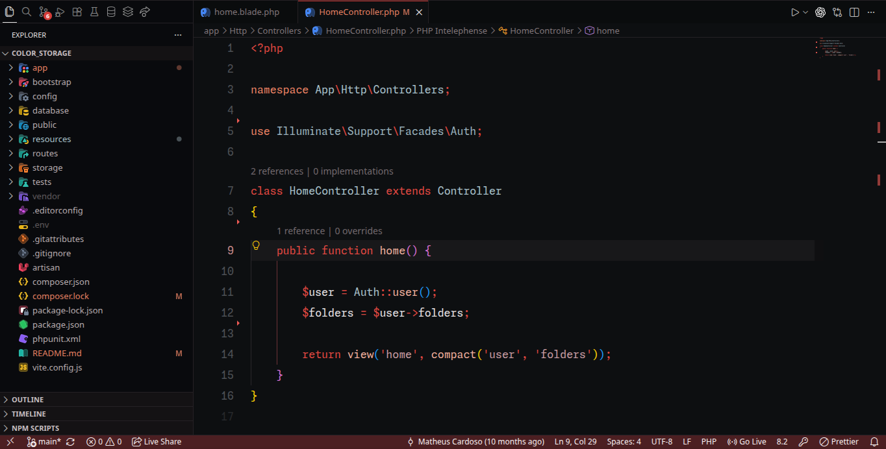

# Spider Noir Darker Theme

A dark VS Code theme built around deep black, crimson red, muted rose, warm salmon and blue-gray accents.



## Highlights

- Deep near-black editor and workbench backgrounds
- Crimson accents for active UI elements and language keywords
- Semantic highlighting for classes, functions, variables, properties and parameters
- Customized terminal ANSI palette
- Colors for Git decorations, diagnostics, diff editor, minimap and suggestions

## Local installation

### From a VSIX file

1. Open VS Code.
2. Run **Extensions: Install from VSIX...** from the Command Palette.
3. Select the generated `.vsix` file.
4. Run **Preferences: Color Theme** and choose **Spider Noir Darker**.

### Development mode

1. Open this folder in VS Code.
2. Press `F5`.
3. In the Extension Development Host window, choose **Spider Noir Darker** from the color-theme picker.

## Packaging

Install dependencies and generate a VSIX:

```bash
npm install
npm run package
```

## Publishing

Before publishing, replace the `publisher` field in `package.json` with your exact Visual Studio Marketplace publisher ID.

```bash
npm run publish
```

## License

MIT
